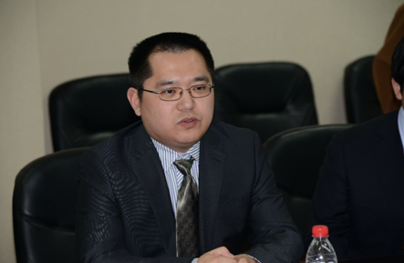

<h1 class="header center blue-text">{{ page.title | escape }}</h1>

    

            

                    
                

                    <h5>Biograph</h5>
                    
叶凯教授于2004年1月赴荷兰莱顿大学（Leiden University）攻读博士学位，自此开始接触生物信息学和基因组学领域，并先后作为博士后研究员、助理教授开展研究工作。2008年始，叶凯教授作为较早接触第二代高通量测序技术和数据的研究人员，以主要成员的身份参与了千人基因组计划（1000 Genomes Project）、美国肿瘤基因组路线图计划（The Cancer Genome Atlas，TCGA）、国际肿瘤基因组计划（The International Cancer Genome Consortium）、荷兰基因组（Genome of the Netherlands）等国际重大科学工程。 
                        叶凯教授在基因组学与生物信息学及其相关领域共发表研究论文50余篇。在Nature杂志（影响因子：41.46）发表研究论文10篇，其中以共同第一作者发表2篇；作为共同作者在Science杂志（影响因子：31.48）发表研究论文3篇。在PNAS、 Nature Genetics、 Nature Medicine、Nature communication、 Nature Method、 Genome Research等高影响因子期刊和Bioinformatics等本领域顶级期刊发表研究论文25篇，其中作为主要作者（第一作者、通讯作者）的有13篇。根据Google学术网站的统计数字，叶凯教授发表的研究论文累计他引19,000余次，单篇最高他引5000余次，他引过百篇的论文已有15篇。

                

                

                    <h5>Education</h5>
                    <table style="border:none;background:none;">
                    <tr>
                        <th>Ph.D.</th>
                        <th>Cum Laude Biopharmaceutical science</th>
                        <th>Leiden University</th>
                        <th>2008.12</th>
                    </tr>
                    <tr style="border:none;background:none;">
                        <th>M.Sc</th>
                        <th>Biopharmaceutical science</th>
                        <th>Wuhan University</th>
                        <th>2003.06 </th>
                    </tr>
                    <tr style="border:none;background:none;">
                        <th>B.A.</th>
                        <th>Biopharmaceutical science</th>
                        <th>Wuhan University</th>
                        <th>1999.06</th>
                    </tr>
                    </table>
                

                

                    <h5>Working Experience</h5>
                    <table style="border:none;background:none;">
                    <tr>
                        <th>Professor</th>
                        <th>Xi’an Jiaotong University</th>
                        <th>2016.02-Present</th>
                    </tr>
                    <tr style="border:none;background:none;">
                        <th>Assistant Professor</th>
                        <th>Washington University in St. Louis</th>
                        <th>2012.12-2016.02</th>
                    </tr>
                    <tr style="border:none;background:none;">
                        <th>Assistant Professor</th>
                        <th>Leiden University</th>
                        <th>2009.07-2012.11</th>
                    </tr>
                    <tr style="border:none;background:none;">
                        <th>Postdoctoral</th>
                        <th>European Bioinformatics Institute</th>
                        <th>2008.07-2009.06 </th>
                    </tr>
                    <tr style="border:none;background:none;">
                        <th>Lecturer</th>
                        <th>Wuhan University</th>
                        <th>2003.07-2003.12</th>
                    </tr>
                    </table>
                

                

                    <h5>Awards and Grants</h5>
                    •	BBMRI-NL rainbow grant, euro 105k, PI, 2011-2014 
                    •	VENI grant from Dutch research organization, euro 250k, PI, 2011-2014 
                    •	BBMRI-NL complementation grant, euro 100k, PI, 2011-2014 
                    •	NIH U41, co-PI, 2013-2015 
                    •	NIH U01, co-PI, 2012-2015 
                    •	June 2009: ‘best paper’ (on Pindel) presented at the Short-SIG on Next-Generation Sequence and Algorithms for Short Read Analysis, ISMB/ECCB 2009 at Stockholm, Sweden. 500 GBP 
                    •	‘Researcher of 2008’, Faculty of Science, Leiden University.  
                    •	2008 C. J. Kok prize, Leiden University, the Netherlands. 2,500 EURO 
                    •	2008 PhD Cum Laude, Leiden University, Leiden, the Netherlands 
                    •	NGI/EBI fellowship, The Netherlands. 36,000 euro per year.      
                    •	‘Top 300 Outstanding PhD students abroad’ Award, China. 5,000 USD 
                    •	2004-2005 Leiden University Scholarship, The Netherlands. 
                    •	2000-2003 Wuhan University fellowship for excellent graduate student, China. 
                    •	1996-1999 Wuhan University fellowship for excellent undergraduate, China. 
            

    

