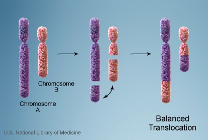
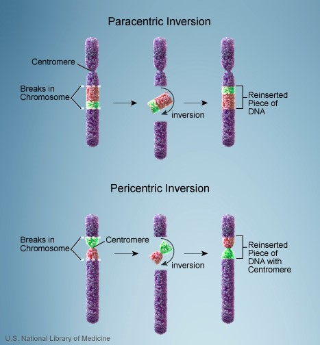
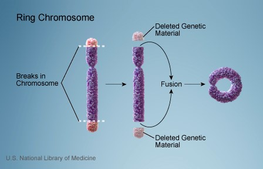
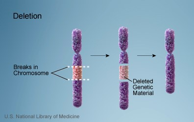
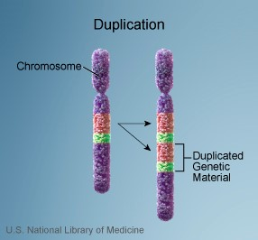
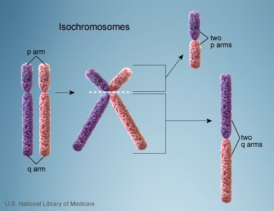

<h1 class="header center blue-text">{{ page.title | escape }}</h1>

<h6 style="font-size:22px;line-height:30px">Differences in chromosome structure are a prominent source of human genetic variation. 
These differences are collectively known as structural variation (SV), 
a term that encompasses diverse genomic alterations including deletion,
 duplication, insertion, inversion, translocation or complex rearrangement of relatively large segments (> 50 bp in length). 
 The challenge now is to discover the full extent of structural variation and to be able to genotype it routinely in 
 order to understand its effects on human disease, complex traits and evolution. </h6>

    

        
    

    

         
         
    

<h6 style="font-size:22px;line-height:30px"> The advent of next-generation sequencing (NGS) technologies promises to revolutionize 
structural variation studies and, ultimately, replace microarrays as 
the platform for discovery and genotyping. However, NGS approaches
 present substantial computational and bioinformatics challenges. 
 There are in general alignment based methods including Pindel, Lumpy 
 and assembly based methods such as novoBreak. However, these 
 approaches are all SV model based, which often miss or miscalculate 
 SVs beyond a model, such as complex structural variants (CSV). 
 We are now developing a model-free SV caller Mako to overcome this 
 problem and use deep learning technology to profile CSVs. </h6>

    

        
    

    

         
    

 
  